

Big Data Analytics.
 
Universidad el bosque.
 
Nombre: Carlos Niño.
 
Profesor: Fabian Peña. 

---------------------------

    :page_facing_up: TALLER 1

<!------------------------------------------------------------ PARTE 1 ------------------------------------------------------->

:pushpin: Parte 1 - Hadoop

   
  1. Se instalo una máquina virtual en VirtualBox con Ubuntu como sistema:
     
   
    
  2. Se siguieron los pasos de esta guía:   
    <a href="http://cis.csuohio.edu/~sschung/cis612/Instruction_INSTALLING_HADOOP_Ubuntu.pdf">Guía Hadoop</a>
      
    Evidencia de su ejecución y funcionamiento:
      
    
   
    

<!------------------------------------------------------------ PARTE 2 ------------------------------------------------------->

:pushpin: Parte 2 - MapReduce

     
   1. Se siguieron los pasos de la <a href="https://hadoop.apache.org/docs/stable/hadoop-project-dist/hadoop-common/SingleCluster.html#Execution">guía oficial</a> de Apache Hadoop, en específico la sección de execution:
     
   &nbsp;&nbsp;1.1. Web interface:
      
    
     
   &nbsp;&nbsp;1.2. Se crearon el siguiente directorio con el siguiente comando de la guía oficial:
      
    <pre><code>bin/hdfs dfs -mkdir /user/hdoop/input </code></pre>
      
    &nbsp;&nbsp;Evidencia:
      
    
      
   &nbsp;&nbsp;1.3. Copiar los archivos etc/hadoop/*.xml a la carpeta input:
      
    &nbsp;&nbsp;Para esto se utiliza el siguiente comando de la guía oficial:
      
    <pre>bin/hdfs dfs -put etc/hadoop/*.xml input</pre>
      
    &nbsp;&nbsp;Evidencia de su ejecución en localhost:
      
    
      
   &nbsp;&nbsp;1.4. Ejecución del ejemplo:
       
    
     
    
     
    
      
   &nbsp;&nbsp;1.5. Salida:
      
    
      
    &nbsp;&nbsp;1.6. ¿Qué resultados generó el programa y cuáles son los pasos MapReduce que implementa?
      
    La salida generada nos muestra todos los archivos que empiecen con dfs de la carpeta input, la cual habíamos subido los archivos de etc/hadoop/*.xml, y cuenta cuantos archivos se llaman así.
      
    En el código <a href="https://github.com/naver/hadoop/blob/master/hadoop-mapreduce-project/hadoop-mapreduce-examples/src/main/java/org/apache/hadoop/examples/Grep.java">grep</a> podemos observar que para mapReduce primero se define un job, el cual será el encargado de generar el MapReduce, este job primero hace el map el cual es el encargado de dividir las nombres de los archivos sacados de la carpeta input, luego se ejecuta la función reduce para cada grupo de datos creados por el map.
      
     La función de map genera una clave, de este modo al hacer reduce se pueden buscar valores asociados a la clave para poder fusionar estos datos y de este modo ir reduciendo los resultados (conjunto más pequeño de valores)
       
     Al finalizar los organiza de manera decreciente, por esta razón en la salida se observa primero los nombres de los archivos que se repiten 2 veces y luego los que se repiten una sola vez.
      
    

<!------------------------------------------------------------ PARTE 2.2. ------------------------------------------------------->
   2. Ejecutar WordCount del <a href="https://github.com/naver/hadoop/tree/master/hadoop-mapreduce-project/hadoop-mapreduce-examples/src/main/java/org/apache/hadoop/examples">jar de ejemplos</a>, cargando al HDFS un archivo de texto plano.
      
    

    
:pushpin: Re-instalación Hadoop

        
     &nbsp;&nbsp; Por problemas técnicos la primera máquina virtual la elimine y cree una nueva, donde maneje la última versión de Hadoop:
          
    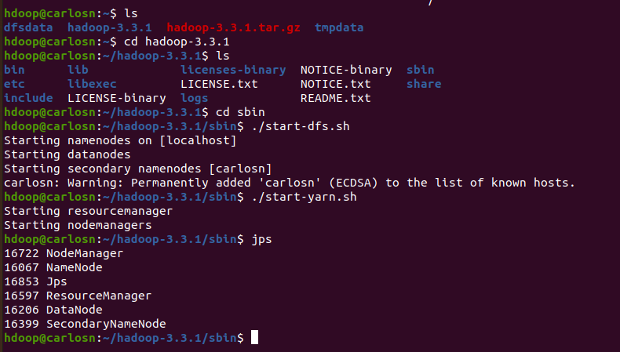
         
    

    &nbsp;&nbsp;2.1. Archivo de texto plano:
      
    &nbsp;&nbsp; Para esta parte copiamos el poema: <a href="https://www.zendalibros.com/los-30-mejores-poemas-en-espanol/">Me gusta cuando callas, de Pablo Neruda</a> y creamos un archivo llamado poema.txt
      
    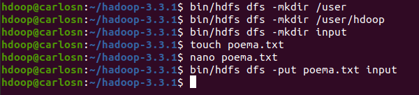
      
    &nbsp;&nbsp;2.2. Archivo cargado al HDFS:
      
    &nbsp;&nbsp; Para subirlo al HDFS:
      
    <pre>bin/hdfs dfs -put poema.txt input</pre>
    &nbsp;&nbsp; Archivo cargado:
      
    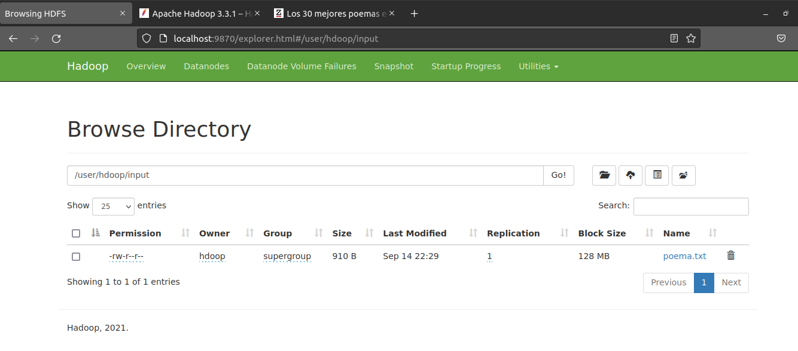
      
    &nbsp;&nbsp;2.3. Ejecución WordCount:
      
    <pre>bin/hadoop jar share/hadoop/mapreduce/hadoop-mapreduce-examples-3.3.1.jar wordcount input output</pre>
    &nbsp;&nbsp;Consola:
      
    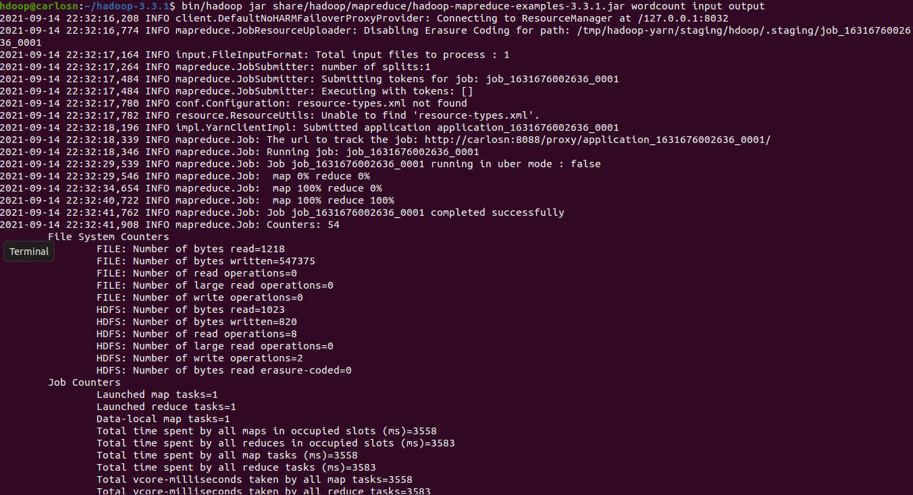
     
    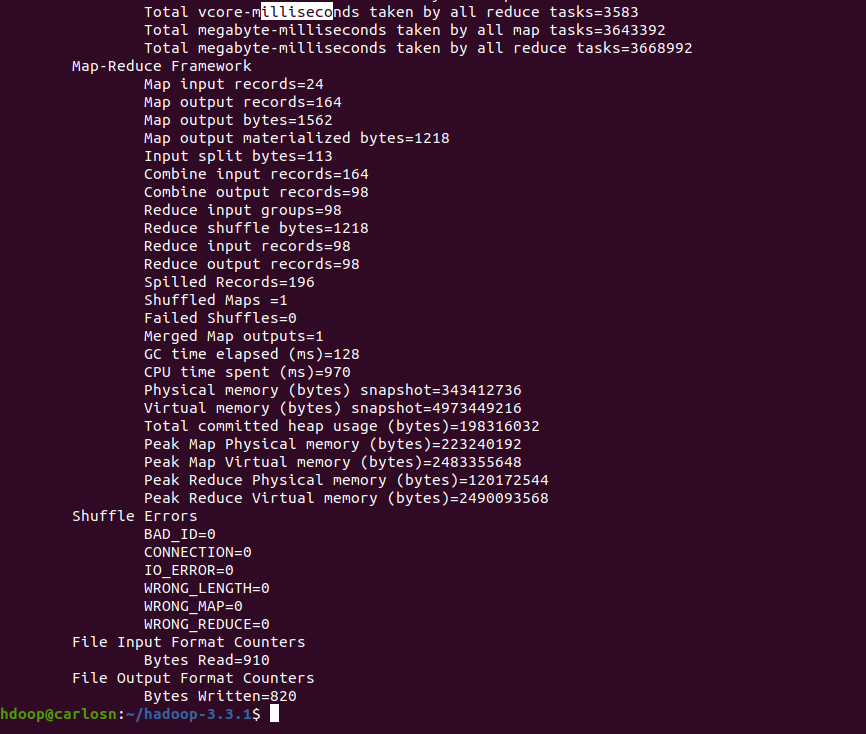
      
    &nbsp;&nbsp;1.5. Salida:
      
    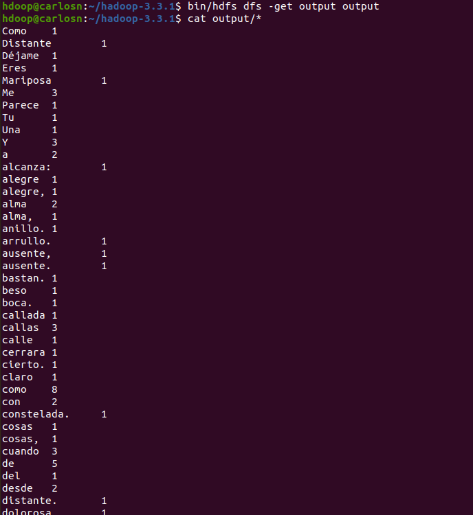
      
    &nbsp;&nbsp; Resultado por localhost:
      
    
      
    &nbsp;&nbsp;2.4. ¿Qué resultados generó el programa y cuáles son los pasos MapReduce que implementa?
      
   El archivo de salida se encuentra en la ruta: <a href="./Parte2/">Parte2/part-r-00000</a>
      
   Como podemos observar la salida es un archivo con la cantidad de veces que aparece cada palabra, para este caso, en el archivo de wordcount.java podemos observar que se genera un job encargado de ejecutar la función map que es la encargada de dividir la información en subconjuntos más pequeños, donde el reduce se aplica a cada uno de estos conjuntos para poder reducirlos.
      
    A diferencia del ejemplo, en este caso no se esta organizando por la cantidad de veces que aparezca una palabra.
    

<!------------------------------------------------------------ PARTE 3 ------------------------------------------------------->

:pushpin: Parte 3 - Spark

  
    1. Se siguieron los pasos de la <a href="http://cis.csuohio.edu/~sschung/cis612/CIS612_SparkInstallation_Ubuntu.pdf">guía</a> para instalar Spark en Ubuntu.
     
    2. Se ejecuta el master y el worker:
      
    <pre>start-master.sh </pre>
    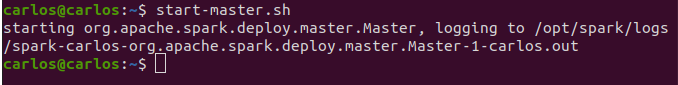
     
    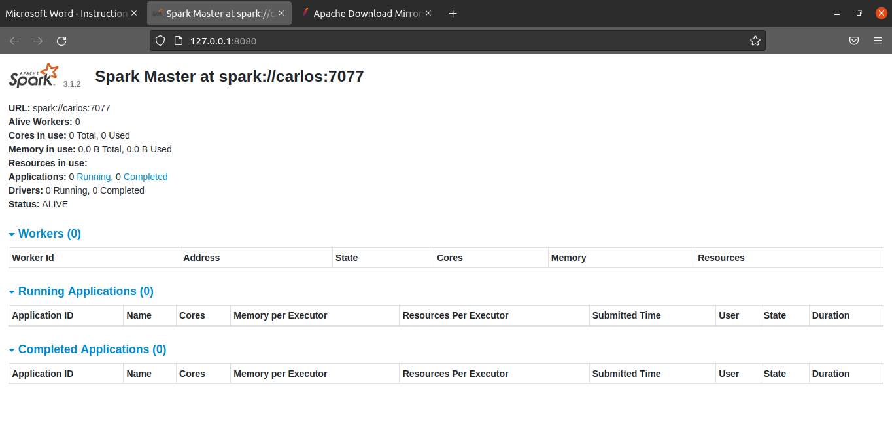
      
    <pre>start-worker.sh spark://carlos:7077 </pre>
    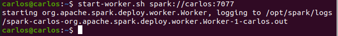
     
    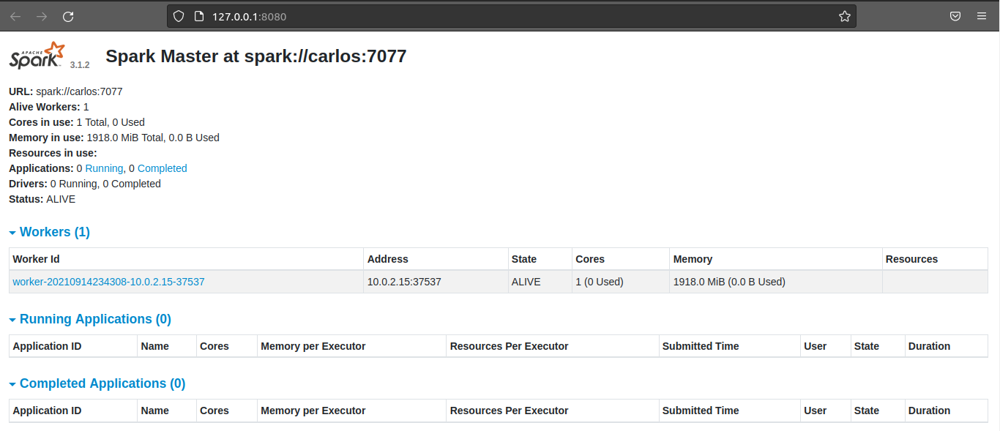
      
    3. Se ejecuta pyspark:
      
    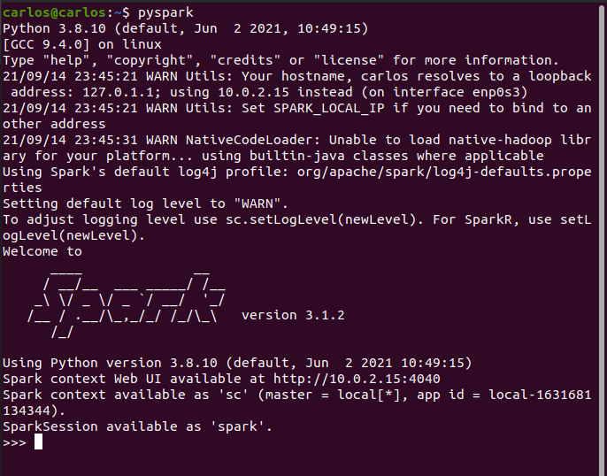
      
    4. Creamos un archivo de texto plano llamado poema.txt, para esta parte copiamos el poema: <a href="https://www.zendalibros.com/los-30-mejores-poemas-en-espanol/">Tú me quieres blanca, de Alfonsina Storni</a>
      
    5. Ejecución wordcount:
      
    En la siguiente imagen se ejecuta el código para el wordCount y observamos que es mucho más simplificado que el wordCount de Hadoop que era en java, en este caso estamos ejecutando la consola de pyspark para poder trabajar con python.
      
    Lo primero es leer el archivo al que queremos contar sus palabras, en este caso el archivo es poema.txt, luego se va a generar un mapa con los valores capturados del texto, estos valores son separador por los espacios entre cada palabra, para luego poder correr el map que asigna llaves para poder hacer reduce y generar el archivo que devolverá cuantas veces aparece esa palabra en el archivo.
      
    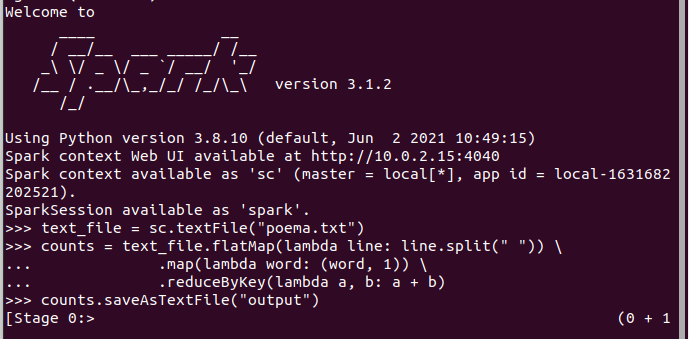
      
    6. El archivo de salida se encuentra en la ruta: <a href="./Parte3/">Parte3/part-r-00000</a>
      

<!------------------------------------------------------------ PARTE 4 ------------------------------------------------------->

:pushpin: Parte 4 - Jupyter Notebook

     
    1. Se clono la carpeta SparkTutorial:
      
    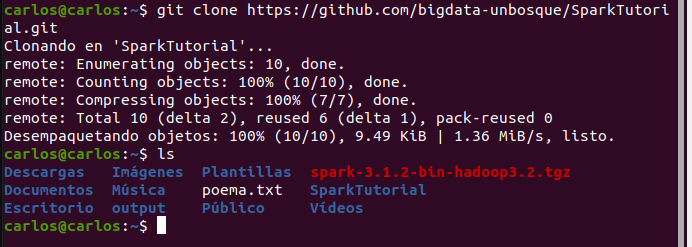
      
    2. Se descargó el archivo: <a href="https://www.kaggle.com/dinnymathew/usstockprices">stocks_price_final.csv</a>
      
    3. Se descargó Anaconda3:
      
    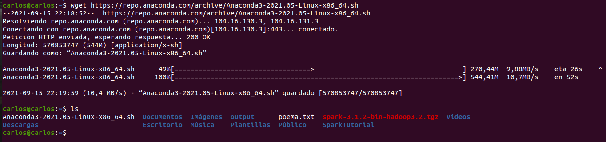
      
    4. Jupyter lab:
      
    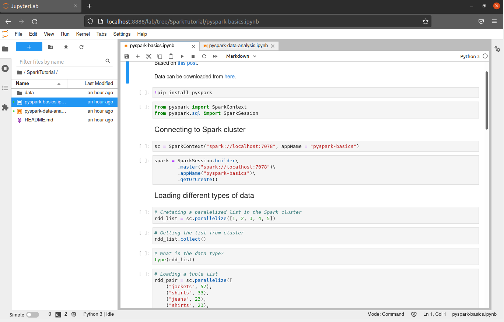
      
    5. La carpeta que contiene los archivos .ipynb es: <a href="./Parte4/SparkTutorial/">Parte4/SparkTutorial</a>
      
    :pencil2: Analisis:
      
    :page_with_curl: <a href="./Parte4/SparkTutorial/pyspark-basics.ipynb">spark-basics.ipynb</a>
      
    Para poder ejecutar el SparkContext coloque la ruta de mi master, que sería spark://carlos:7077, ya que colocando spark://localhost:7078 me negaba la conexión, pero al colocar el master si ha podido crear el context ya que no se niega la conexión, de igual manera podemos observar que en el master que si se han ejecutado las aplicaciones, para este caso el appName era pyspark-basics.
      
    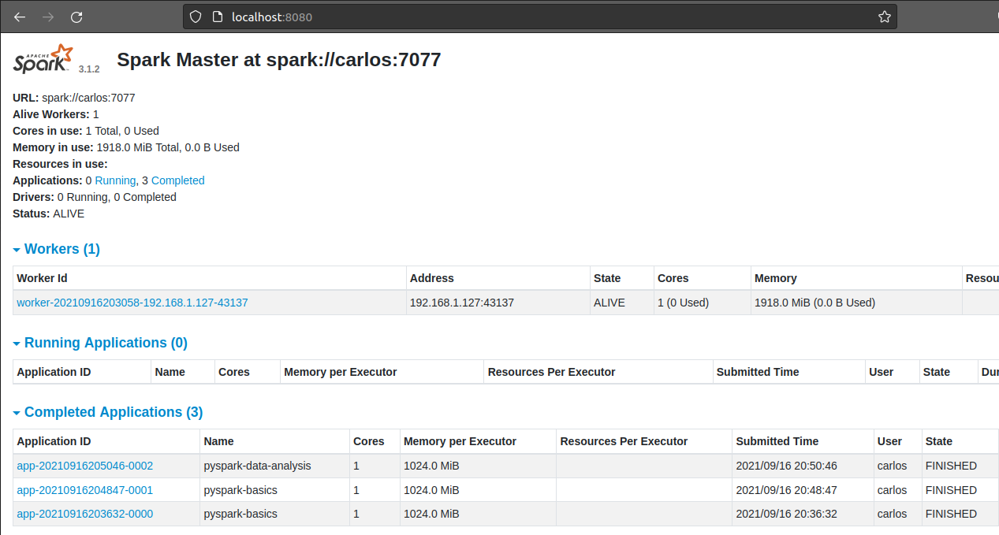
      
   En el ejercicio se nos muestra algunas clases de tipos de conjuntos por decirle, como las tuplas o listas, también a leer el texto de un archivo y sacar una cantidad de registros de ese documento.
      
    En el caso del archivo stocks_price_final.csv, el ejercicio nos muestra cómo saber cuántos registros totales tiene y poder imprimir las columnas y que tipo de datos son estas columnas en este archivo.
      
    También nos muestra cómo podemos hacer map, el cual podemos observar que genera varios subconjuntos dentro del conjunto principal, y como obtener un flat structure, que sería un conjunto de datos sin los subconjuntos adentro.
      
    Al final nos muestra cómo funciona el reduceByKey y organizan los resultados por la llave, siendo de manera descendente.
      
    :page_with_curl: <a href="./Parte4/SparkTutorial/pyspark-data-analysis.ipynb">pyspark-data-analysis.ipynb</a>
      
   Para este ejercicio se inicia construyendo una sesión con el appName pyspark-data-analysis.
      
    Lo primero es leer el archivo stocks_price_final.csv definiendo su separador (sep = ","), se nos muestra como contar los registros, y como poder cambiar la estructura de las columnas del archivo, ya que, se cambian los tipos de datos de algunas columnas.
      
    Luego de esto, se filtran los datos y se transforman con pandas para poder graficarlos, las siguientes gráficas hacen referencia al precio con respecto al tiempo de TSLA y GME.
      
    La siguiente grafica haría referencia a la cantidad de empresas por sector.
      
    Por último, almacenamos la información en un archivo .csv, esta información serían los precios más altos y bajos por fecha. Este archivo se encuentra: <a href="./Parte4/SparkTutorial/Resultado/">aquí</a>
      
      
    Nota: En la carpeta <a href="./Parte4/SparkTutorial/Html">Parte4/SparkTutorial/Html</a> se anexan los archivos ejecutados de jupyter lab exportados como html por si acaso.

