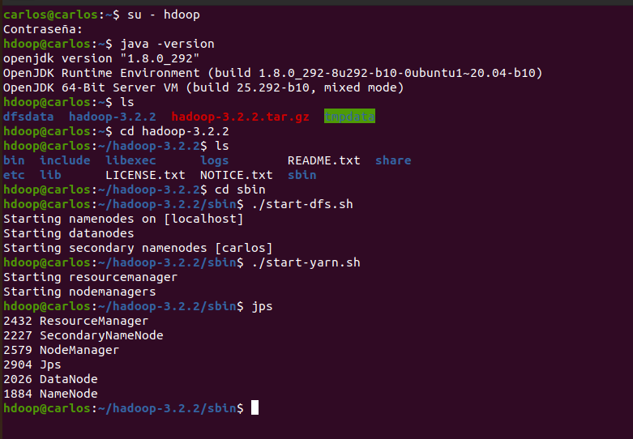
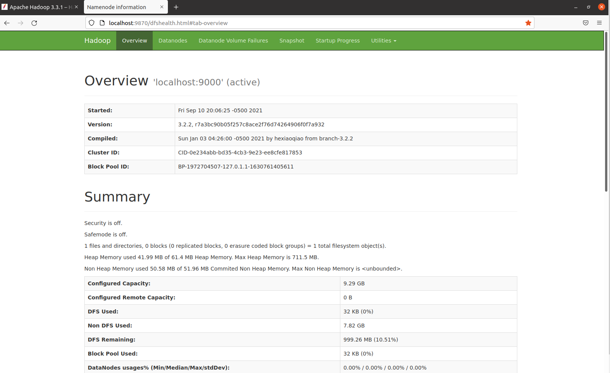
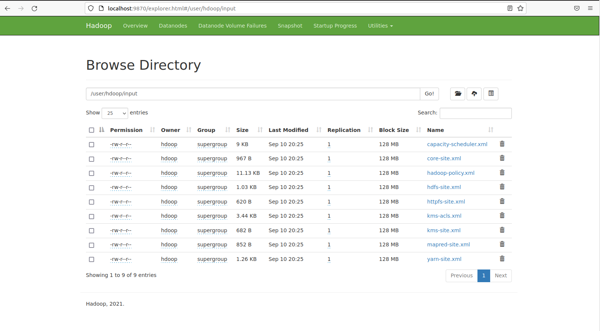
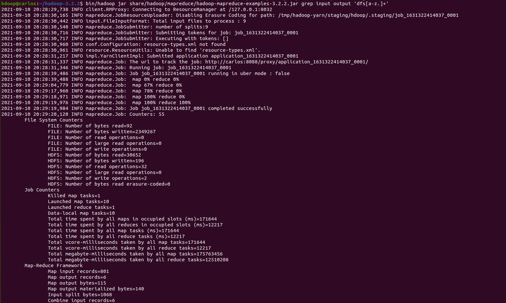
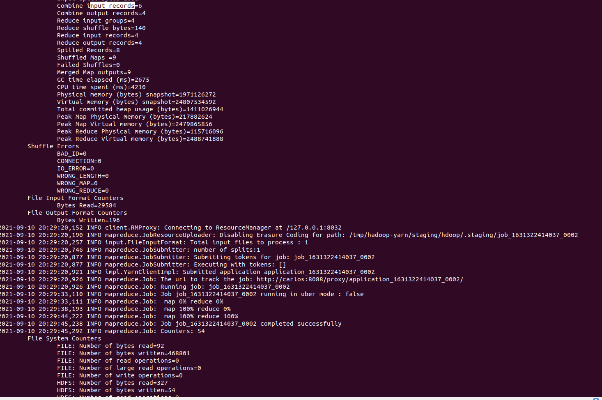
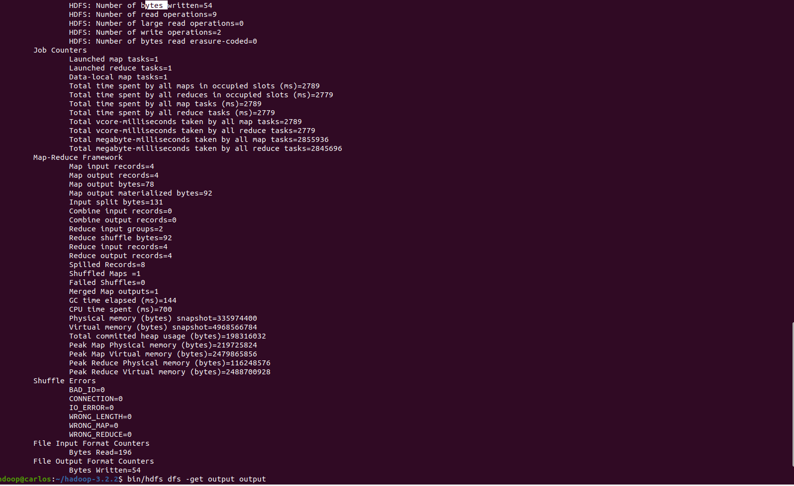
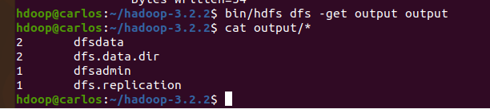
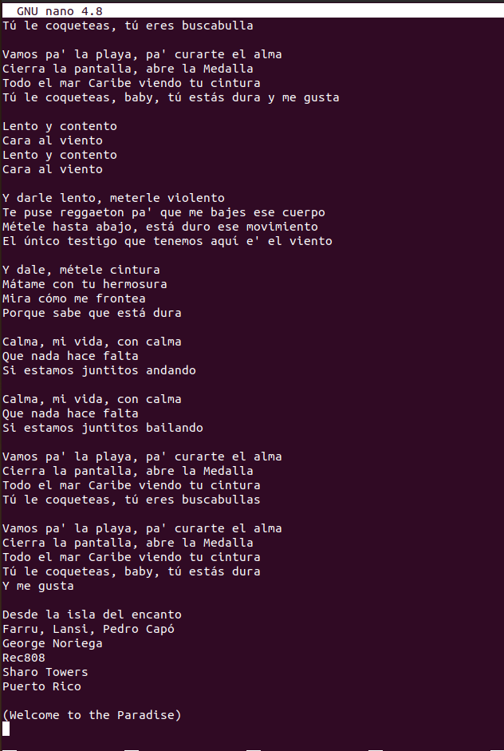
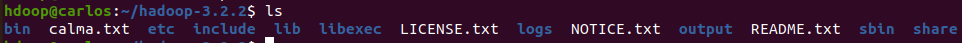
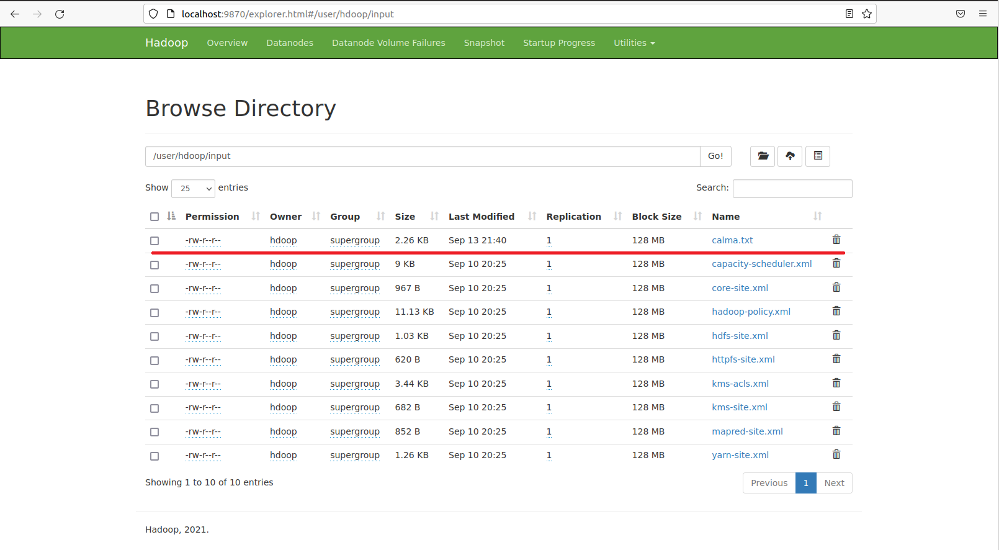

Big Data Analytics.
 
Universidad el bosque.
 
Nombre: Carlos Niño.
 
Profesor: Fabian Peña. 

---------------------------

    :page_facing_up: TALLER 1

<!------------------------------------------------------------ PARTE 1 ------------------------------------------------------->

:pushpin: Parte 1 - Hadoop

   
  1. Se instalo una maquina virtual en VirtualBox con Ubuntu como sistema:
     
   

   
  2. Se siguieron los pasos de esta guía:   
    <a href="http://cis.csuohio.edu/~sschung/cis612/Instruction_INSTALLING_HADOOP_Ubuntu.pdf">Guía Hadoop</a>
      
    Evidencia de su ejecución y funcionamiento:
      
    
   
    

<!------------------------------------------------------------ PARTE 2 ------------------------------------------------------->

:pushpin: Parte 2 - MapReduce

     
   1. Se siguieron los pasos de la <a href="https://hadoop.apache.org/docs/stable/hadoop-project-dist/hadoop-common/SingleCluster.html#Execution">guía oficial</a> de Apache Hadoop, en especifico la sección de execution:
    
   &nbsp;&nbsp;1.1. Web interface:
      
    
    
   &nbsp;&nbsp;1.2. Se crearon el siguiente directorio con el siguiente comando de la guía oficial:
      
    <pre><code>bin/hdfs dfs -mkdir /user/hdoop/input </code></pre>
      
    &nbsp;&nbsp;Evidencia:
      
    
     
   &nbsp;&nbsp;1.3. Copiar los archivos etc/hadoop/*.xml a la carpeta input:
      
    &nbsp;&nbsp;Para esto se utiliza el siguiente comando de la guía oficial:
      
    <pre>bin/hdfs dfs -put etc/hadoop/*.xml input</pre>
      
    &nbsp;&nbsp;Evidencia de su ejecución en localhost:
      
    
     
   &nbsp;&nbsp;1.4. Ejecución del ejemplo:
       
    
     
    
     
    
     
   &nbsp;&nbsp;1.5. Archivo de salida:
      
    
      
    &nbsp;&nbsp;1.6. ¿Qué resultados generó el programa y cuales son los pasos MapReduce que implementa?
     
    &nbsp;&nbsp;
     
    

   2. Ejecutar WordCount del <a href="https://github.com/naver/hadoop/tree/master/hadoop-mapreduce-project/hadoop-mapreduce-examples/src/main/java/org/apache/hadoop/examples">jar de ejemplos</a>, cargando al HDFS un archivo de texto plano.
     
    &nbsp;&nbsp;2.1. Archivo de texto plano:
     
    &nbsp;&nbsp; Para esta parte copiamos la letra de la canción <a href="https://www.letras.com/pedro-capo/calma-remix-part-farruko/">calma</a> y creamos un archivo llamado calma.txt
      
    
     
    &nbsp;&nbsp; Este archivo lo guardamos en la carpeta de hadoop:
      
    
     
    &nbsp;&nbsp;2.2. Archivo cargado al HDFS:
     
    &nbsp;&nbsp; Para subirlo al HDFS:
      
    <pre>bin/hdfs dfs -put calma.txt input</pre>
     
    &nbsp;&nbsp; Archivo cargado:
      
    
     
    &nbsp;&nbsp;2.3. Ejecución WordCount:
      
    &nbsp;&nbsp;2.4. ¿Qué resultados generó el programa y cuales son los pasos MapReduce que implementa?
     
    
  

<!------------------------------------------------------------ PARTE 3 ------------------------------------------------------->

:pushpin: Parte 3 - Spark

this is hidden

<!------------------------------------------------------------ PARTE 4 ------------------------------------------------------->

:pushpin: Parte 4 - Jupyter Notebook

this is hidden

