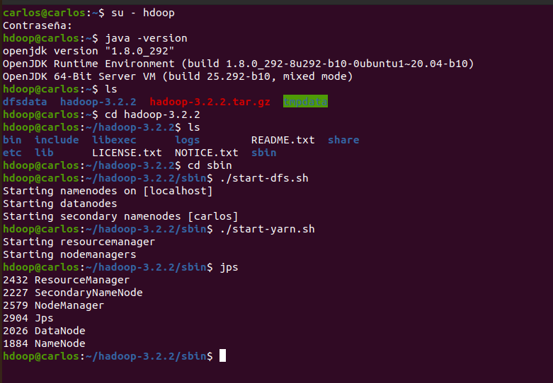

Big Data Analytics.
 
Universidad el bosque.
 
Nombre: Carlos Niño.
 
Profesor: Fabian Peña. 

---------------------------

    :page_facing_up: TALLER 1

:pushpin: Parte 1

   
  1. Se instalo una maquina virtual en VirtualBox con Ubuntu como sistema:
     
   

   
  2. Se siguieron los pasos de esta guía:   
    <a href="http://cis.csuohio.edu/~sschung/cis612/Instruction_INSTALLING_HADOOP_Ubuntu.pdf">Guía Hadoop</a>
      
    Evidencia:
      
    
   
    

:pushpin: Parte 2

this is hidden

:pushpin: Parte 3

this is hidden

:pushpin: Parte 4

this is hidden

